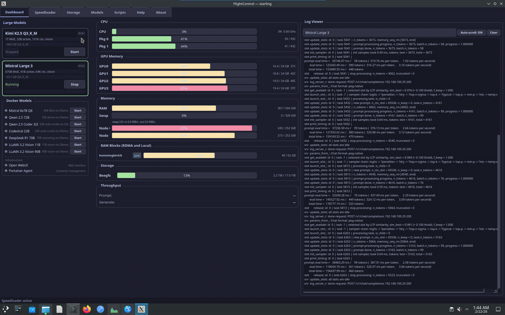
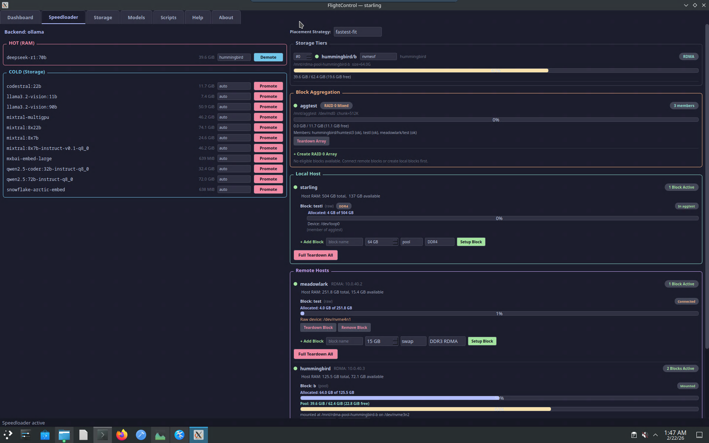
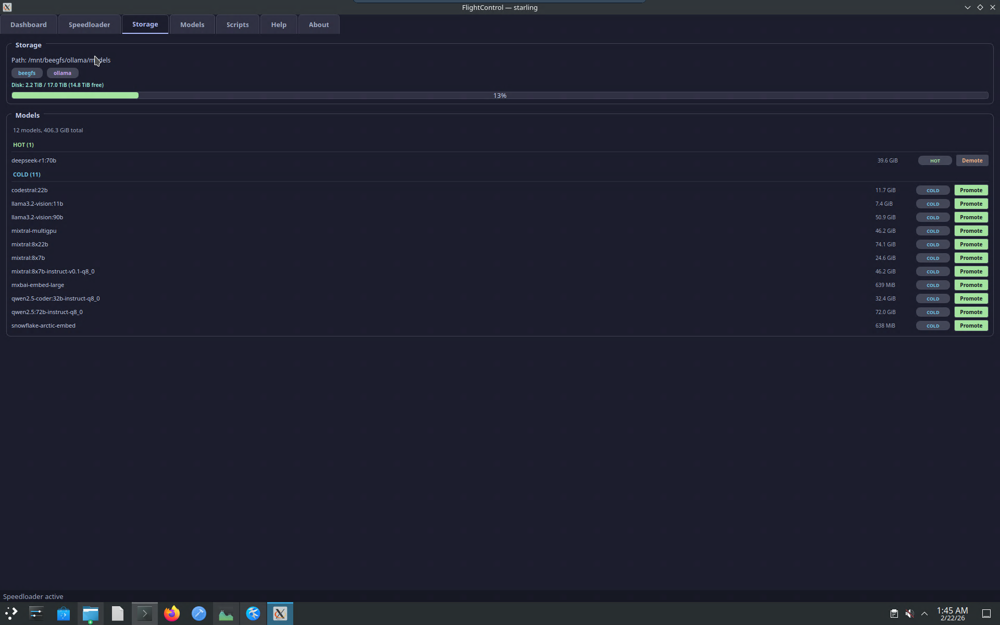
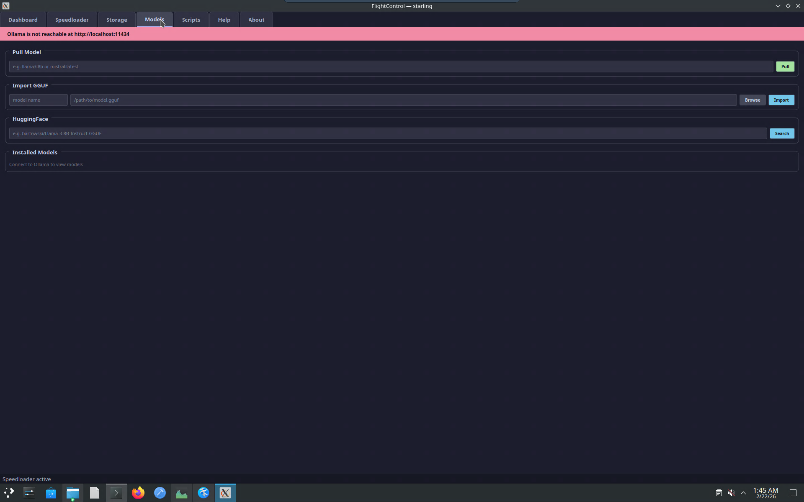
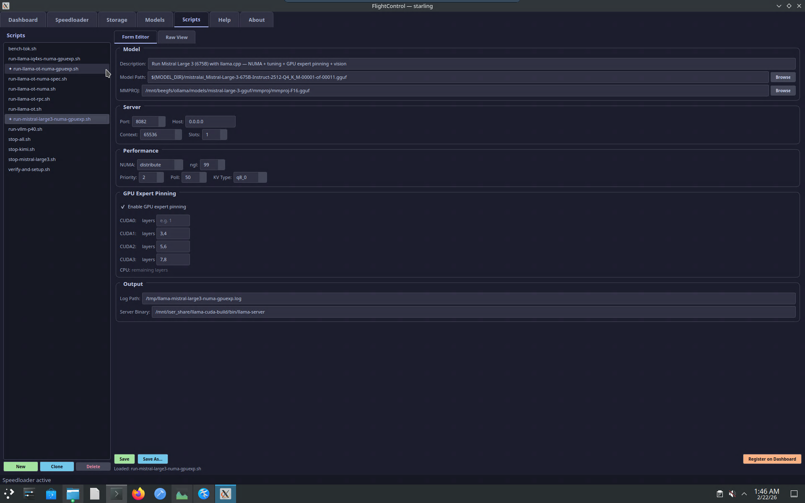

# FlightControl

A PyQt5 dashboard for managing GPU inference servers, RAM-tiered model caching, and distributed block storage across multi-node clusters.



## Features

### Dashboard
- Real-time CPU, GPU, and RAM monitoring with per-core/per-device breakdown
- Model lifecycle management (start, stop, health checks)
- Docker container status and control
- Live log viewer with throughput parsing
- RDMA/InfiniBand resource panel

### Speedloader (RAM Tier Management)
- **Storage Tiers** — Manage multiple tmpfs-backed RAM tiers with priority-based model placement
- **Model Placement** — Strategies: fastest-fit, fill-first, round-robin with per-model tier pinning
- **Remote Hosts** — NVMe-oF over RDMA block devices from remote machines (swap, pool, or raw)
- **Local Raw Blocks** — Loop-backed block devices from local RAM for RAID membership
- **Block Aggregation** — Combine blocks across hosts into mdadm RAID 0 arrays for high-throughput model loading



### Storage
- BeeGFS/NFS/local storage monitoring
- Hot (RAM) and Cold (disk) model inventory
- One-click promote/demote between tiers



### Models
- Pull models from Ollama registry
- Import local GGUF files
- Search and download from HuggingFace



### Scripts
- Script editor with syntax highlighting
- Configurable launch parameters (GPU layers, context size, threads, batch size)
- GPU expert pinning for MoE models
- One-click run with output capture



## Status

The Python source for FlightControl has been removed as the core Speedloader backend is being rewritten in Rust. The Rust implementation is available at [Skylark-Software/speedloader](https://github.com/Skylark-Software/speedloader).

This repository preserves the project overview, architecture reference, and screenshots from the PyQt5 prototype.

## Requirements

- Python 3.10+
- PyQt5
- SSH key access to a local service account for privileged operations
- Optional: Ollama, llama.cpp, or vLLM backend
- Optional: NVMe-oF/RDMA for remote block devices
- Optional: mdadm for block aggregation

## Configuration

FlightControl reads its Speedloader config from `/etc/speedloader/config.json` (or `~/.config/speedloader/config.json`). The main app config defines model definitions, script paths, and polling intervals.

## Architecture

```
FlightControl/
├── main.py                  # Application entry point
├── main_window.py           # Main window with tab wiring
├── config.py                # App configuration and model definitions
├── speedloader/             # Speedloader library
│   ├── __init__.py          # SpeedloaderManager (orchestrator)
│   ├── config.py            # JSON config dataclasses
│   ├── remote.py            # NVMe-oF remote host management
│   ├── raid.py              # RAID 0 block aggregation (mdadm)
│   ├── tiers.py             # RAM tier management
│   ├── backends/            # Inference backend adapters
│   │   ├── ollama.py
│   │   ├── llamacpp.py
│   │   └── vllm.py
│   └── system/              # System utilities
│       ├── ramdisk.py
│       └── ssh.py
├── widgets/                 # PyQt5 UI components
│   ├── speedloader_tab.py   # Speedloader management tab
│   ├── storage_tab.py       # Storage and model inventory
│   ├── models_tab.py        # Model download/import
│   ├── scripts_tab.py       # Script editor and launcher
│   └── ...                  # Dashboard panels
├── workers/                 # Background QThread workers
│   ├── speedloader_worker.py
│   ├── monitor_worker.py
│   └── ...
└── utils/                   # Parsing and process utilities
```


## License

Copyright (c) 2025 Skylark Software. All rights reserved.
