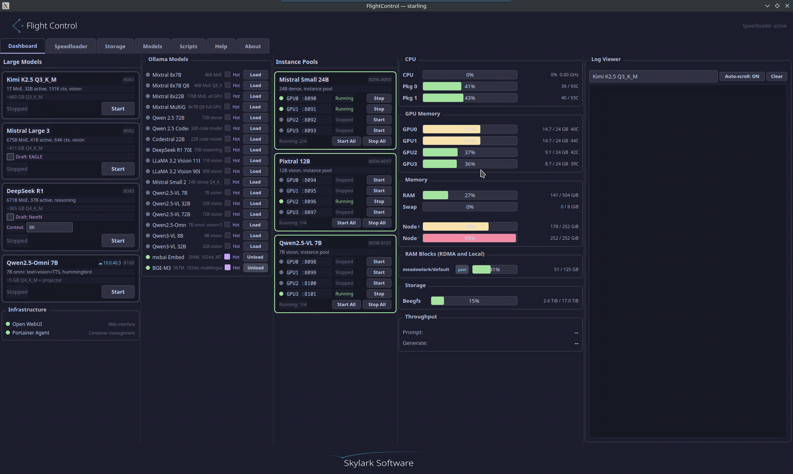
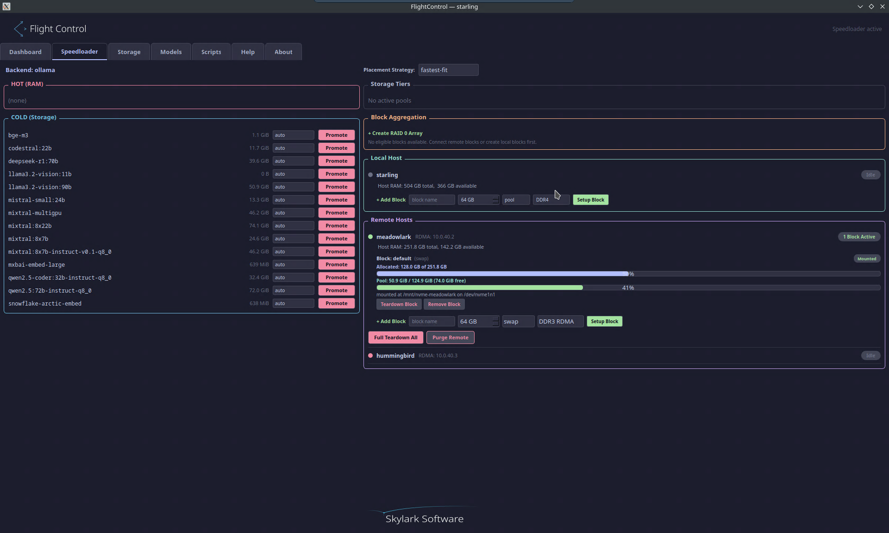
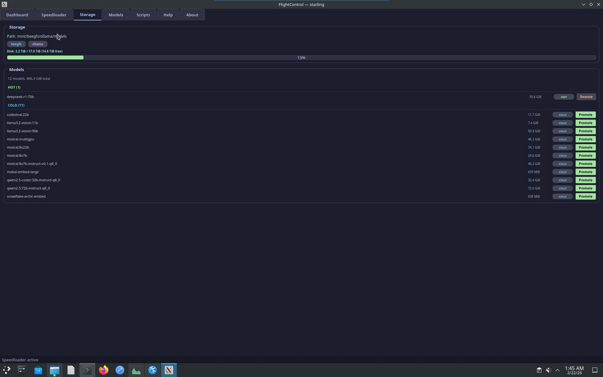
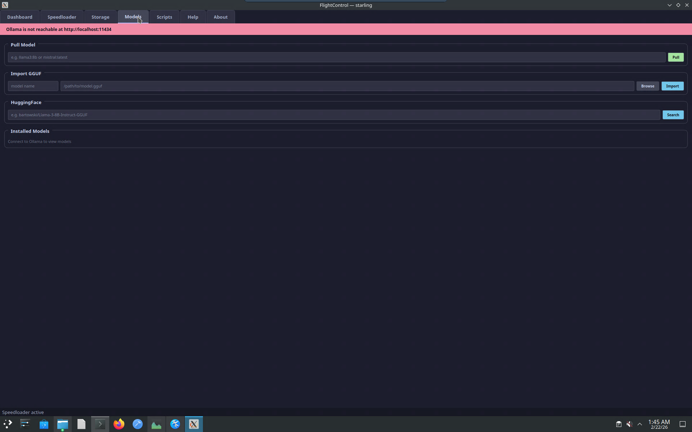
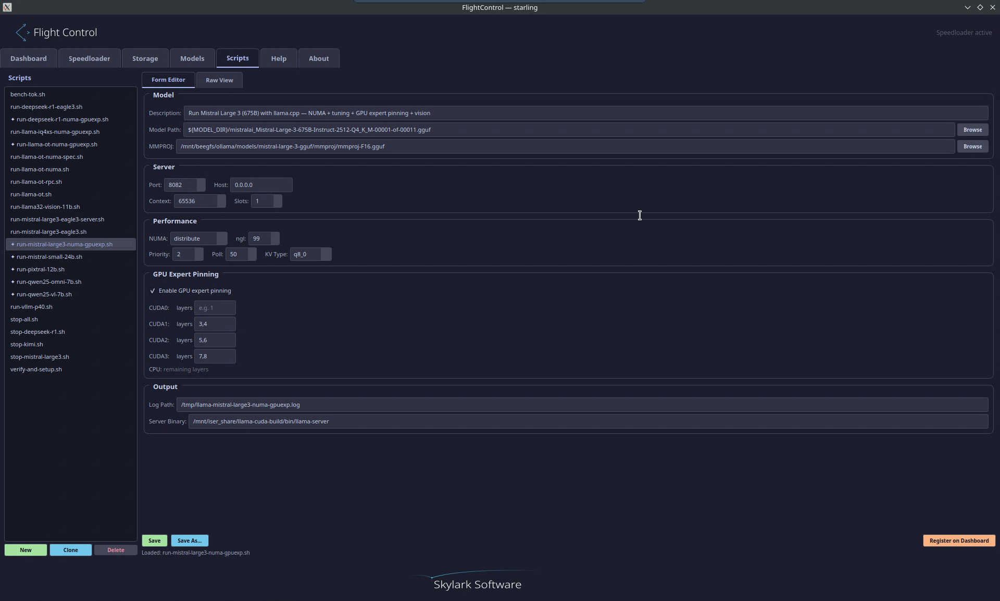

  

# FlightControl

> **Note:** FlightControl is being rewritten in Rust. The Speedloader backend is available at [Skylark-Software/Speedloader](https://github.com/Skylark-Software/Speedloader). This repository preserves the project overview and screenshots from the PyQt5 prototype.

A PyQt5 dashboard for managing GPU inference servers, RAM-tiered model caching, and distributed block storage across multi-node clusters.

---

## Features

### Dashboard
- Real-time CPU, GPU, and RAM monitoring with per-core/per-device breakdown
- Model lifecycle management (start, stop, health checks)
- Docker container status and control
- Live log viewer with throughput parsing
- RDMA/InfiniBand resource panel

### Speedloader (RAM Tier Management)
- **Storage Tiers** — Multiple tmpfs-backed RAM tiers with priority-based model placement
- **Model Placement** — Strategies: fastest-fit, fill-first, round-robin with per-model tier pinning
- **Remote Hosts** — NVMe-oF over RDMA block devices from remote machines (swap, pool, or raw)
- **Local Raw Blocks** — Loop-backed block devices from local RAM for RAID membership
- **Block Aggregation** — Combine blocks across hosts into mdadm RAID 0 arrays for high-throughput model loading

The Speedloader backend has been extracted and rewritten in Rust as a standalone tool: [Skylark-Software/Speedloader](https://github.com/Skylark-Software/Speedloader)

### Storage
- BeeGFS/NFS/local storage monitoring
- Hot (RAM) and Cold (disk) model inventory
- One-click promote/demote between tiers

### Models
- Pull models from Ollama registry
- Import local GGUF files
- Search and download from HuggingFace

### Scripts
- Script editor with syntax highlighting
- Configurable launch parameters (GPU layers, context size, threads, batch size)
- GPU expert pinning for MoE models
- One-click run with output capture

---

## Related Projects

| Project | Description |
|---------|-------------|
| [Speedloader](https://github.com/Skylark-Software/Speedloader) | Rust rewrite of the Speedloader backend — fast hybrid RAM/storage management for LLM models |
| [EagleBranch](https://github.com/Skylark-Software/EagleBranch) | EAGLE speculative decoding for Mistral Large 3 and DeepSeek (llama.cpp fork) |

---

## License

Copyright (c) 2025-2026 Skylark Software LLC. All rights reserved.

This software is provided for viewing and reference purposes only. No permission is granted to use, copy, modify, merge, publish, distribute, sublicense, or sell copies without explicit written permission. See [LICENSE](LICENSE).

---

  

